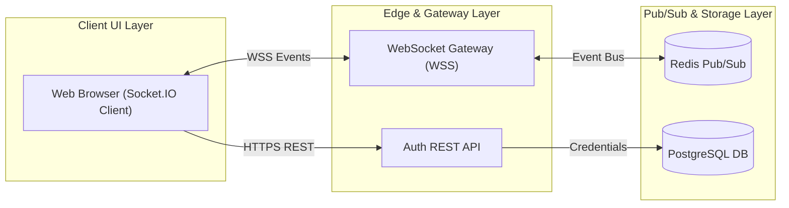

# 🚀 SE-Mini-Proj — Real-Time Chat Application

  
  
  
  

---

## 📌 About the Organization & Project

Welcome to the official **SE-Mini-Proj** organization. We are **Team 5** from the Department of Computer Science & Engineering at **PES University**, building a production-ready, low-latency **Real-Time Chat Application** based on socket programming (WebSockets/Socket.IO), JWT authentication, Redis Pub/Sub event broadcasting, and PostgreSQL durable persistence.

---

## 🏛️ Repositories & Project Ecosystem

| Repository | Description | Key Deliverables & Artifacts | Status |
| :--- | :--- | :--- | :---: |
| 📘 **[SE-Mini-Proj / SRS](https://github.com/SE-Mini-Proj/SRS)** | **Software Requirements Specification** | Requirements gathering, functional features (CHAT-F-001 to CHAT-F-061), quality attributes, & use-case models. | `Completed` |
| 🏗️ **[SE-Mini-Proj / SAD_Chat_Application](https://github.com/SE-Mini-Proj/SAD_Chat_Application)** | **Software Architecture & Code Base** | Event-driven service split architecture, sequence diagrams, REST API endpoints, WebSocket Gateway, Sprint 1 source code, test suite, & CI/CD pipeline. | `Active / Sprint 1` |
| 🧪 **[SE-Mini-Proj / TEST](https://github.com/SE-Mini-Proj/TEST)** | **Software Test Plan & QA** | Test strategy, test matrix, boundary conditions, performance benchmark targets, & unit/integration test cases. | `Active` |
| ⚙️ **[SE-Mini-Proj / .github](https://github.com/SE-Mini-Proj/.github)** | **Organization Profile** | Organization overview, team contribution breakdown, architecture summary, and sitemap. | `Maintained` |

---

## ⚡ Architecture & Tech Stack

### Core Technologies
- **Real-Time Gateway:** Node.js, Socket.IO (`ws` engine), WSS protocol
- **Backend REST API:** Express.js, JSON Web Tokens (JWT), bcryptjs
- **Persistence & Ephemeral Store:** PostgreSQL, Redis Pub/Sub
- **Testing & Quality Assurance:** Jest, Supertest (32 Unit & Integration Tests)
- **Continuous Integration (CI/CD):** GitHub Actions Workflow (`.github/workflows/ci.yml`)

---

## 👥 Team Members & SRN

| Name | SRN | Primary Roles & Focus |
| :--- | :--- | :--- |
| **Pranay Shah** | `PES2UG24CS366` | Team Lead, SRS & SAD Architecture Lead, System Structuring & Integration |
| **Nikhil Mahabala Shekar** | `PES2UG24CS318` | Component Architecture, Data Store Topology & Backend Services |
| **Prarthana Herur** | `PES2UG24CS367` | Security Architecture (STRIDE Threat Model), Requirements Traceability & QA |
| **Nikhil B Menon** | `PES2UG24CS317` | Sequence Diagrams, API Design, WebSocket Gateway & UX Architecture |

---

## 🛠️ Sprint 1 Highlights & Development Progress

- ✅ **Authentication Service:** User registration (`POST /api/auth/register`), login (`POST /api/auth/login`), bcrypt password hashing, and signed JWT token issuance.
- ✅ **Chat Room Engine:** Public & private chat room creation, invite code verification, and room rosters.
- ✅ **WebSocket Gateway:** Real-time event broadcasting (`message:send`, `message:receive`), typing indicators, and presence tracking.
- ✅ **Test Suite:** 32 passing Unit and Integration test cases covering positive paths, boundary conditions, and unauthorized access scenarios.
- ✅ **CI/CD Automation:** Automated GitHub Actions matrix build & test pipeline executing on Node.js 18.x, 20.x, and 22.x.

---

  <b>Department of Computer Science & Engineering</b> 
  PES University • Bengaluru, India

